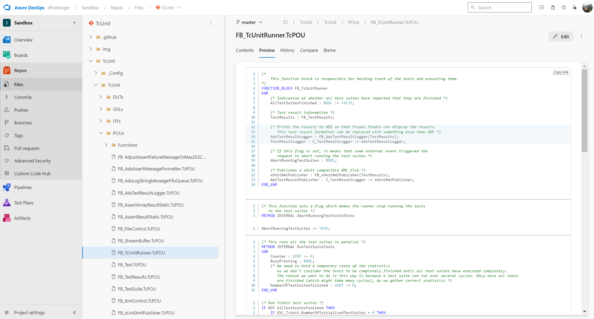

# TcPreview

This unofficial extension allows previewing of Beckhoff TwinCAT 3 files within Azure DevOps. The source code is available on [GitHub](https://github.com/dfreiberger/tc-preview-extension).

It currently supports the `.TcPOU`, `.TcDUT`, `.TcGVL` and `.TcIO` file extensions. Only Structured Text (ST) is supported, so any sections of the code that are in another format such as LD, FBD or UML will not be displayed.

To see a preview of a file, open it from `Repos > Files` and select the Preview tab. You can also see previews within pull requests or from the search view.

Pull requests are welcome.

## Attributions

<a href="https://www.flaticon.com/free-icons/cat" title="cat icons">The cat icon used for the logo was created by Freepik - Flaticon</a>