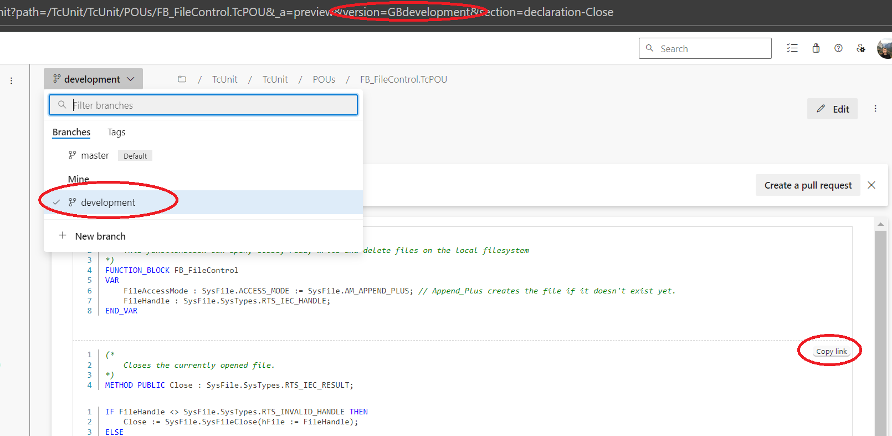

# TcPreview

This unofficial extension allows previewing of Beckhoff TwinCAT 3 files within Azure DevOps. The source code is available on [GitHub](https://github.com/dfreiberger/tc-preview-extension).

It currently supports the `.TcPOU`, `.TcDUT`, `.TcGVL` and `.TcIO` file extensions. 

To see a preview of a file, open it from `Repos > Files` and select the Preview tab. You can also see previews within pull requests or from the search view.

It is also possible to copy a link to a specific section of code by clicking the `Copy link` button.


Pull requests are welcome.

## Limitations

Only Structured Text (ST) is supported, so any sections of the code that are in another format such as LD, FBD or UML will not be displayed.

The Copy link feature only works for the default branch, or for branches that have been actively selected by choosing them in the branch dropdown first before copying the link. This appears to be a limitation of Azure DevOps and the same issue is present when copying links to normal source files.



## Development

To develop locally, create an Azure DevOps organization and publish this extension in dev mode to it.

```
$env:ADO_PUBLISH_TOKEN="your token here"
npm run compile:dev
tfx extension publish --manifest-globs vss-extension.json --overrides-file configs/dev.json --token $env:ADO_PUBLISH_TOKEN --output-path out\
```

Start the local web server
```
webpack-dev-server --mode development
```

Launch Google Chrome or your web browser and navigate to https://localhost:3000. You will need to accept / bypass the security warning.

Navigate to a Structured Text file in your Azure DevOps organization and click the Preview tab. You should be seeing content rendered from the local web server.

See https://devblogs.microsoft.com/devops/streamlining-azure-devops-extension-development/ for more information.

## Attributions

<a href="https://www.flaticon.com/free-icons/cat" title="cat icons">The cat icon used for the logo was created by Freepik - Flaticon</a>